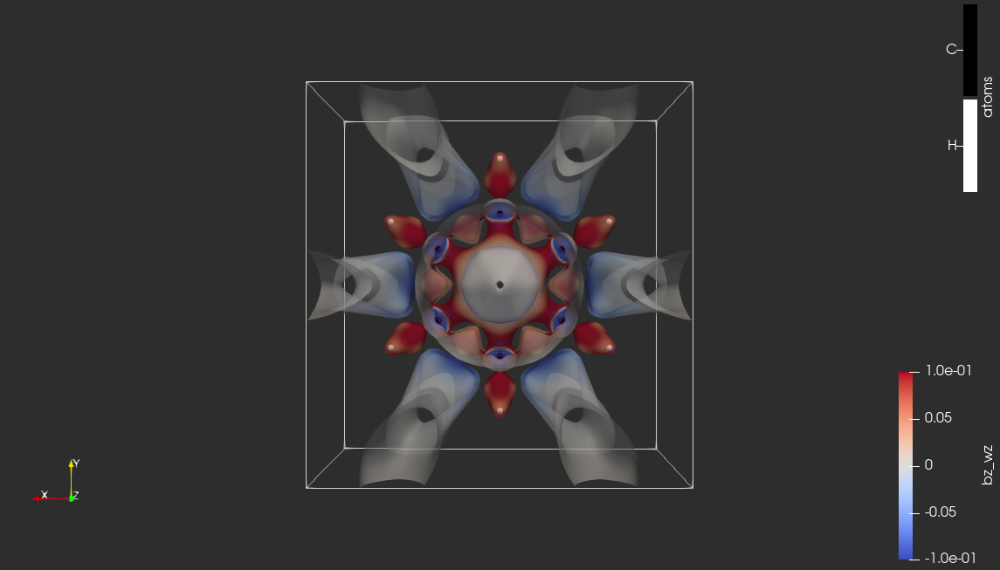

# The magnetically-induced current density in C6H6 molecule studied with the Omega function

|  |
|:--:|
| Contour of omega_bz colored by bz_wz. Isovalue: omega_bz=0.52, bz_wz scale: restricted to [-0.1, 0.1]|

## Pipeline description

## Inputs

* Molecular geometry of C6H6 molecule in CSV format (in atomic units): [C6H6.csv](https://github.com/tda-qchem/tda-qchem-explorations/blob/main/data/C6H6_MICD/C6H6.csv)

* MICD-related data in VTI format:

    * Omega function derived from the magnetically-induced current density vector corresponding to the perturbation of the magnetic field applied perpendicularly to the ring of C atoms: [start_data_omega_bz.vti](https://github.com/tda-qchem/tda-qchem-explorations/blob/main/data/C6H6_MICD/vti/start_data_omega_bz.vti); data description:
        * *omega_bz* - corresponds to Omega function calculated for the magnetic field (*b*) applied in z-direction;
        * *bz_wz* - corresponds to the z-component of the curl of the current density vector (*j*) induced by the magnetic field (*b*) applied in z-direction; it is a zz-component of the vorticity tensor.

## Outputs

