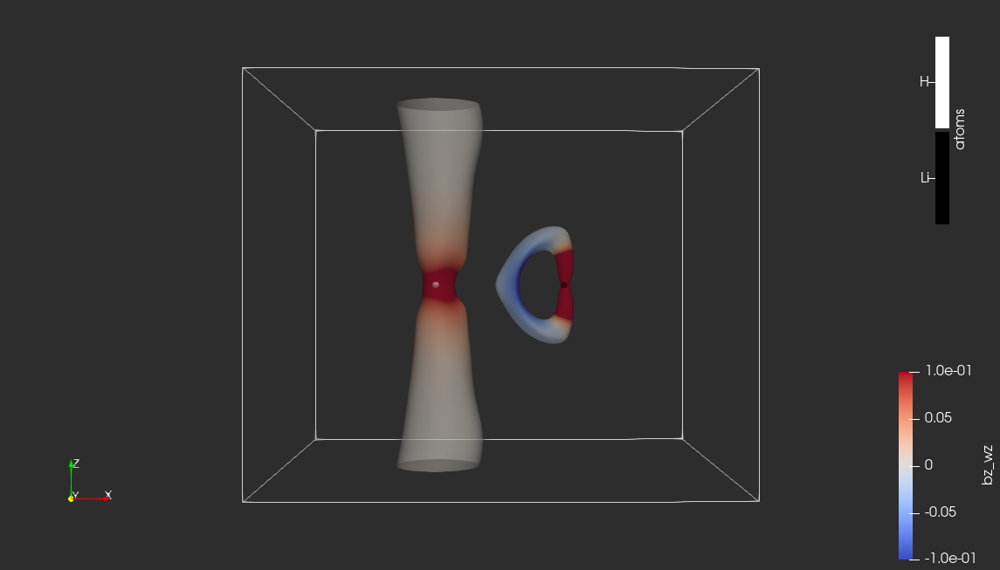

# The magnetically-induced current density in LiH molecule

|  |
|:--:|
| Contour of omega_bz colored by bz_wz. Isovalue: omega_bz=0.75, bz_wz scale: restricted to [-0.1, 0.1]|

## Pipeline description

## Inputs

* Molecular geometry of LiH molecule in CSV format (in atomic units): [LiH.csv](https://github.com/tda-qchem/tda-qchem-explorations/blob/main/data/LiH_MICD/LiH.csv)

* MICD-related data in VTI format:

  * Omega function derived from the magnetically-induced current density vector corresponding to the perturbation of the magnetic field applied perpendicularly to the Li-H bond: [start_data_omega_bz.vti](https://github.com/tda-qchem/tda-qchem-explorations/blob/main/data/LiH_MICD/vti/start_data_omega_bz.vti); data description:
    * *omega_bz* - corresponds to Omega function calculated for the magnetic field (*b*) applied perpendicularly to the Li-H bond (*z*);
    * *bz_wz* - corresponds to the z-component of the curl of the current density vector (*j*) induced by the magnetic field (*b*) applied perpendicularly to the Li-H bond (*z*); it is a zz-component of the vorticity tensor.

## Outputs

