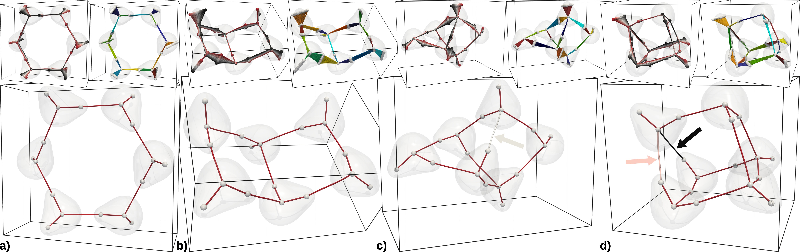

This website collects examples of TDA applications to Quantum Chemistry. It is a scratch repository for generating examples discussed in the TDA-QCHEM book.

Each example includes:
* inputs and run scripts for relevant quantum chemistry software,
* a short description of outputs from quantum chemistry calculations,
* screenshots from [TTK](https://topology-tool-kit.github.io/),
* a ParaView state file that allows reproducing the figures,
* a Python code that allows reproducing the full workflow,
* a short description of outputs and analysis in [TTK](https://topology-tool-kit.github.io/)
* links to relevant quantum chemistry software and [TTK](https://topology-tool-kit.github.io/) documentation

This website also contains:

* A list of molecular descriptors (with the notation and analytical formulas): [link](definitions.md)
* A short description of quantum chemistry and data models used in all calculations: [link](models.md)

How to cite this website:
* TODO: mention it is a companion to our book
* TODO: add DOI

# Prerequisites

These examples assume a default installation of [DIRAC](http://www.diracprogram.org/), [TTK](https://topology-tool-kit.github.io/) and [qcten](https://github.com/gosiao/qcten).
Selected examples also use [CREST](XXX) and [AMS](xxx) software. Among all these codes, only `AMS` is commercial; however, all quantum chemistry data is also available for download at [this link](xxx).
Add info about conda environment; additional scripts for HPC; etc.

# Full pipeline automatization

TODO

# List of examples

Summary and work progress: [LINK-TODO](XXXX)

## Completed and published

| Name | Screenshot |
|:-:|:-:|
|[The magnetically-induced current density in LiH molecule studied with the Omega function](LiH_MICD/)|{width=200}|
|[Exploring the potential energy surface of water hexamer through its electron density: chemical bond robustness under molecular vibrations](water_clusters_isomers_robustness.md)||

## Unpublished

| Name | Screenshot |
|:-:|:-:|

|[Description of covalent and hydrogen bonds in water dimer](water_dimer_bonds)|{width=200}|
|[Description of hydrogen bonds in formamide dimer](formamide_dimer_bonds)|{width=200}|
|[Description of hydrogen bonds in benzene-HF dimer](benzene_hf_dimer_bonds)|{width=200}|
|[Description of intramolecular hydrogen bonds in derivatives of 1H-pyrrole](intramolecular_hydrogen_bonds.md)||
|[The evolution of hydrogen bond networks: the electron-density-based description of isomers of water clusters of increasing size](water_clusters_isomers_growing.md)||

|[Description of simple halogen bonds: At-At $\cdots$ NH3 example](AtAtNH3_ED_RDG_bonds)||
|[Exploring the transfer of relativistic effects in halogen-bonded complexes](relativistic-xbs.md)||

|[Elusive intramolecular Au $\cdots$ H non-covalent interaction in a small gold complexes](elusiveAuH_ED_RDG_bonds.md)||

|[Chemical insights from the analysis of the molecular electrostatic potential](MESP_theory.md)||
|[The joint analysis of the electron density and the reduced density gradient](bivariate_ED_RDG.md)||
|[The joint analysis of the electron density and the molecular electrostatic potential](bivariate_ED_MESP.md)||

|[Exploring correlations between the electron density and the bare nuclear potential in a few selected simple molecules](simple_ED_BNP_homemorphisms.md)||
|[Exploring correlations between the electron density and the bare nuclear potential in a few selected simple molecules](simple_ED_BNP_homemorphisms.md)||
|[Exploring correlations between the electron density and the bare nuclear potential in a set of water clusters](water_clusters_ED-BNP-homeomorphism.md)||
|[Exploring the topology of the molecular electrostatic potential in simple molecules](MESP_theory)||

### Calculations in progress:

| Name | Screenshot |
|:-:|:-:|

|[Potential energy surface exploration: description of isomers in a set of water clusters](water_clusters_PES_isomers.md)||

|[Exploring $\sigma$-hole interactions through the topology of the molecular electrostatic potential and the electron density on benchmark data sets](sigma-hole-interactions-database)||

|[The magnetically-induced current density in simple molecules: analysis of the selected scalar functions](MICD_simple/)||

### Old files, need review:

[The magnetically-induced current density in C6H6 molecule studied with the Omega function](C6H6_MICD/)
[The magnetically-induced current density in C4H4 molecule studied with the Omega function](C4H4_MICD/)
[Partitioning of a scalar function and integration over basins: electron density of H2O molecule](H2O_ED_basins/)

## List of molecular systems under study

