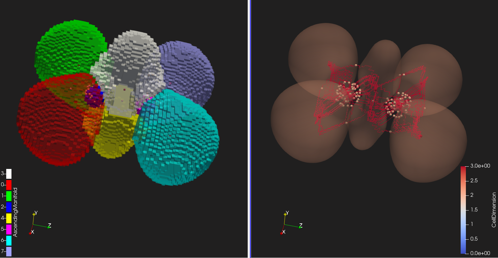
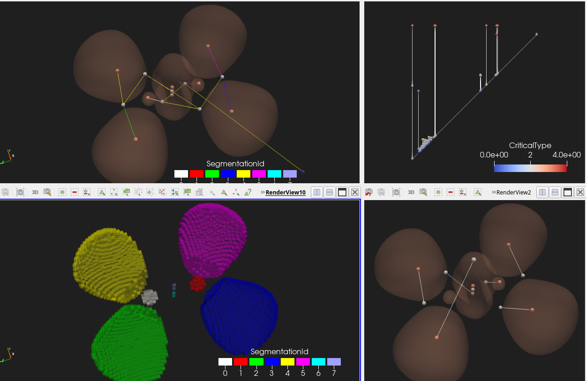

# Description of covalent bonds in small hydrocarbons from the perspective of electron localization function

<div class="grid" markdown>





</div>

<div style="font-size: 75%;"><b><i>
left: The output of the Morse-Smale Cmplex analysis of ELF of C2H4: its ascending manifolds recover ELF basins (left), and the selected critical points and 1-Separatrices are shown on the right, together with ELF countour (for ELF=0.7);
right: A screenshot of ELF analysis: Output from the MergeTree analysis of ELF of C2H4 (left side), with Nodes and Arcs (upper left), and Segmentation for RegionType=1 (bottom left); in particular, that segmentation recovers ELF basins; the right side pictures the persistence diagram of this function in 2D (upper right) and embedded in the domain (bottom right)
</i></b></div>

---

# Chemical context


# Pipeline description


## Topological analysis of ELF


{width=75%}

{width=75%}


# Technical details

## Quantum chemistry calculations

### Setup


### Calculations


## Generation of VTI files


## Topological Data Analysis

* download data from Zenodo to `data/small_hydrocarbons_bonds_elf_lol/vti` and unpack it; (for links, see `project:simple_hydrocarbons` in `external_data.md`)


* go to the root directory of this repository ([here](../)) and enter the following command:

```
paraview --state=pvsm/small_hydrocarbons_bonds_elf_lol/draft.pvsm
```


Related: https://topology-tool-kit.github.io/examples/mergeTreeExTreeM/


