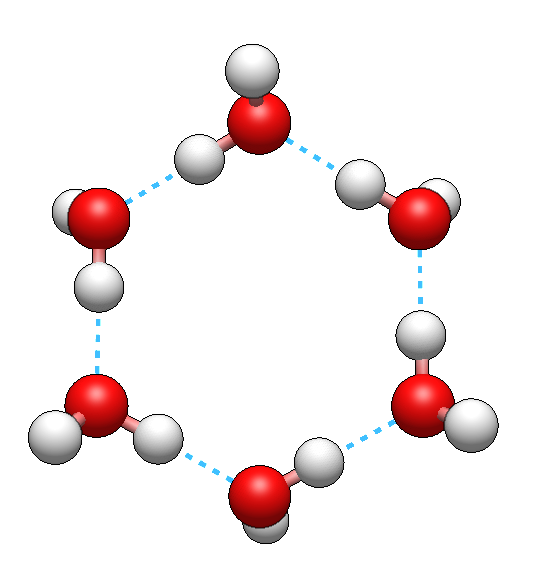
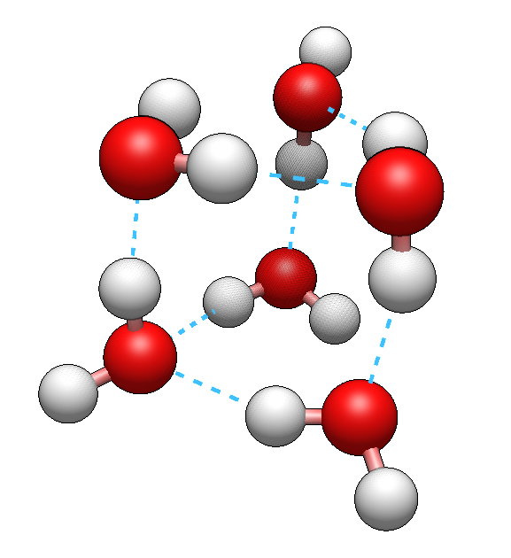
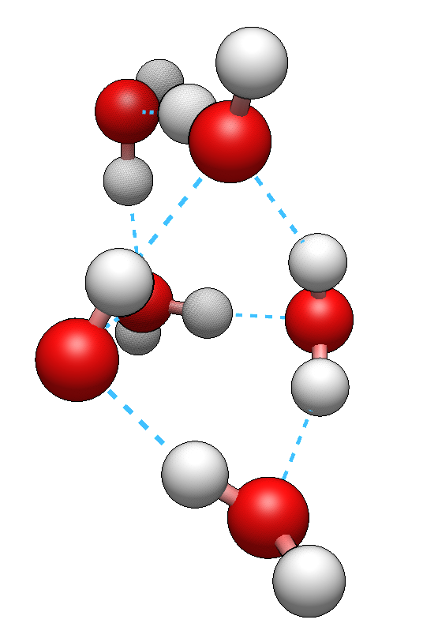
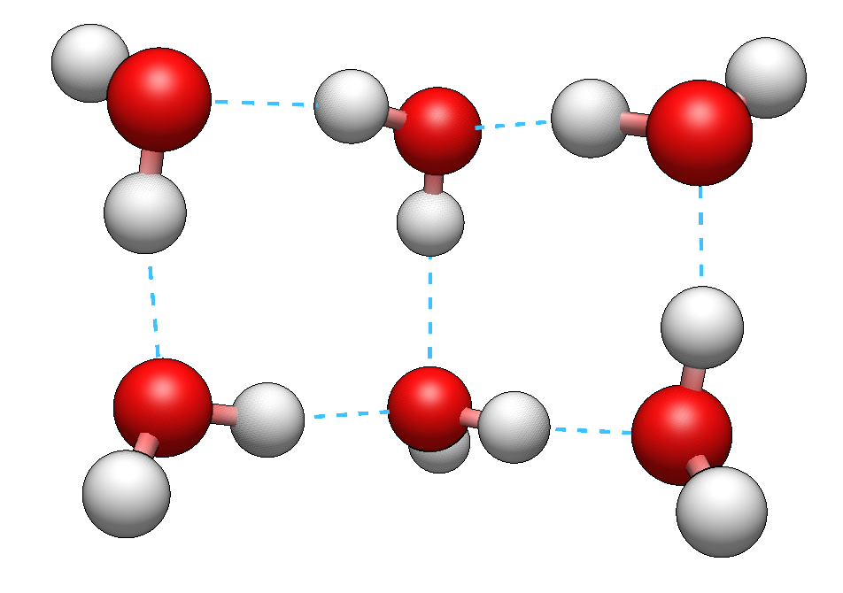
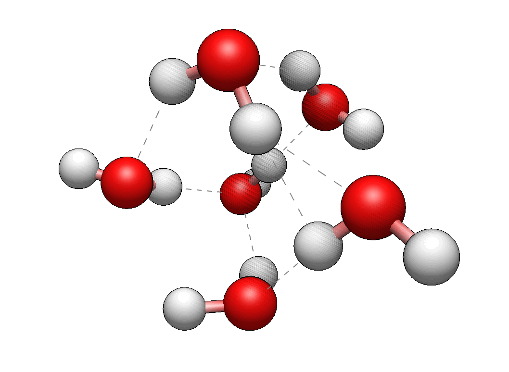

# Exploring the robustness of hydrogen bonds in isomers of water hexamer under molecular vibrations

<b><i>
WRITEME
</i></b>

---

# Chemical context

In this example, we demonstrate the application of the BondMatcher algorith.

# Pipeline description

This example illustrates the analysis of the electron density (ED) of a few selected isomers of water hexamer, (H2O)6, to which we refer here as "W6".
In the following sections, we describe how to generate the data and apply the TTK's BondMatcher algorithm for their topological analysis. The details are in [this publication](https://arxiv.org/abs/2504.03205).

# Technical details

## Quantum chemistry calculations

### Description

The initial molecular structures of four isomers of W6 (precisely, ring, prism, cage, and book- from left to right, below),

{width=20%}
{width=20%}
{width=20%}
{width=20%}

were taken from the literature. The first step involved the geometry optimization and frequency calculations. The latter confirmed that the optimized geometries correspond to the ground electronic state, and yielded a set of $3N_{at} - 6$ = 48 normal modes for each isomer.
Secondly, for each normal mode of each isomer, we generated 20 (an arbitrary value) structures by distorting the equilibrium structure in $+\vec{v}$ and $-\vec{v}$ directions, where $\vec{v}$ represents a normal mode vector. This led to 21 geometries in total (including the equilibrium geometry). The extreme displacements of nuclei were calculated assuming the classical turing point (in a simple harmonic model of vibrations) multiplied by 4 (an arbitrary value). 

All calculations were done in the AMS software using PyADF and in-house scripts (available [in `data` directory](../data/water_clusters_W6_isomers)), using the non-relativistic Hamiltonian, the DFT method with the PBE0 functional, and the TZ2P basis set.

The vibrations of all isomers can be explored in a Jupyter notebook (also available [in `data` directory](../data/water_clusters_W6_isomers)). The gif below presents one of the selected modes: 

In a final step, we calculated the electron densities of all structures, and exported them on the rectilinear grids using the 0.05 Angstrom resolution.

The databases of VTI files with the electron density scalar fields can also be downloaded from Zenodo:

- W6 prism (data in parts):
    * https://zenodo.org/records/14909151
    * https://zenodo.org/records/14909166
    * https://zenodo.org/records/14909176
    * https://zenodo.org/records/14909184
- W6 cage (data in parts):
    * https://zenodo.org/records/14909192
    * https://zenodo.org/records/14909206
    * https://zenodo.org/records/14909210
    * https://zenodo.org/records/14909213
- W6 book (data in parts):
    * https://zenodo.org/records/14911631
    * https://zenodo.org/records/14911637
    * https://zenodo.org/records/14911639
    * https://zenodo.org/records/14911644
- W6 ring (data in parts):
    * https://zenodo.org/records/14911658
    * https://zenodo.org/records/14911654
    * https://zenodo.org/records/14911650
    * https://zenodo.org/records/14911646

## Topological Data Analysis

TODO later

