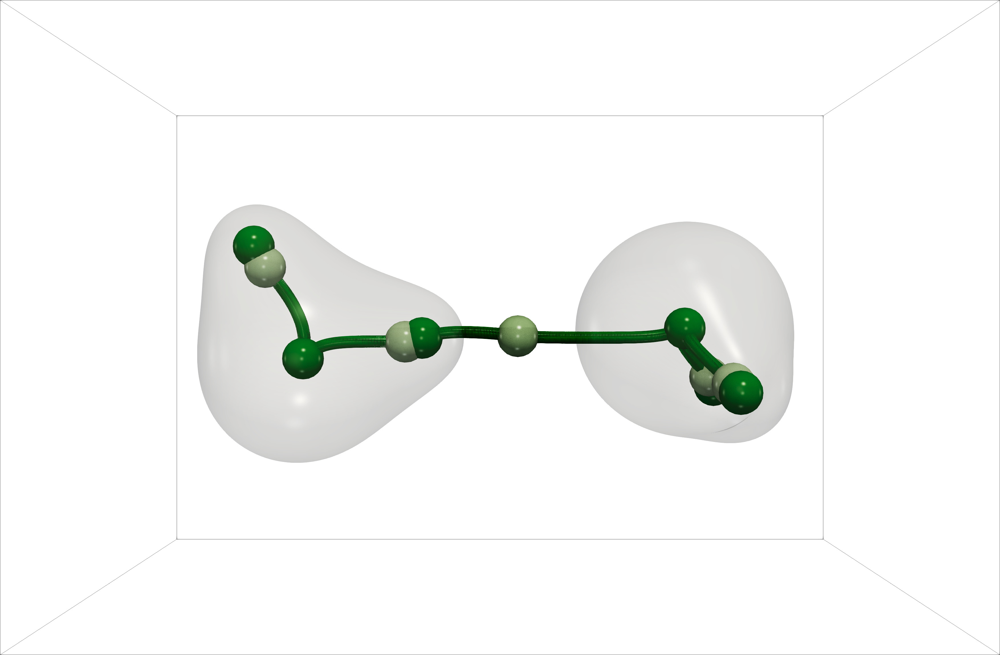
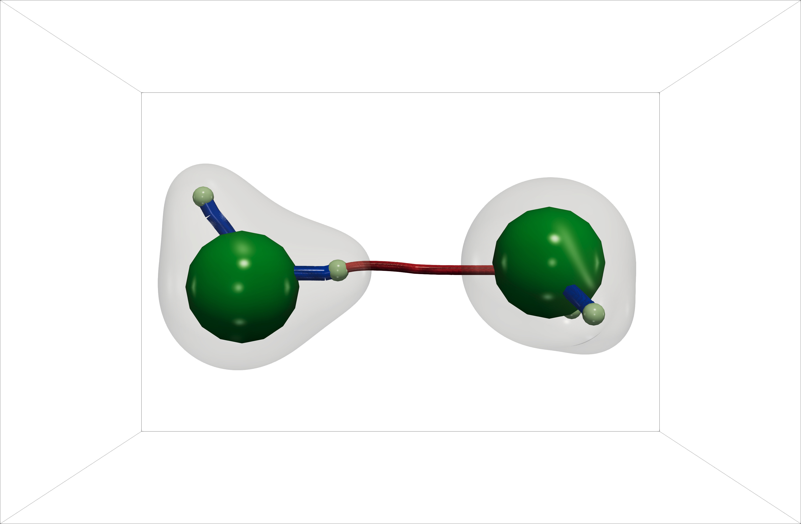
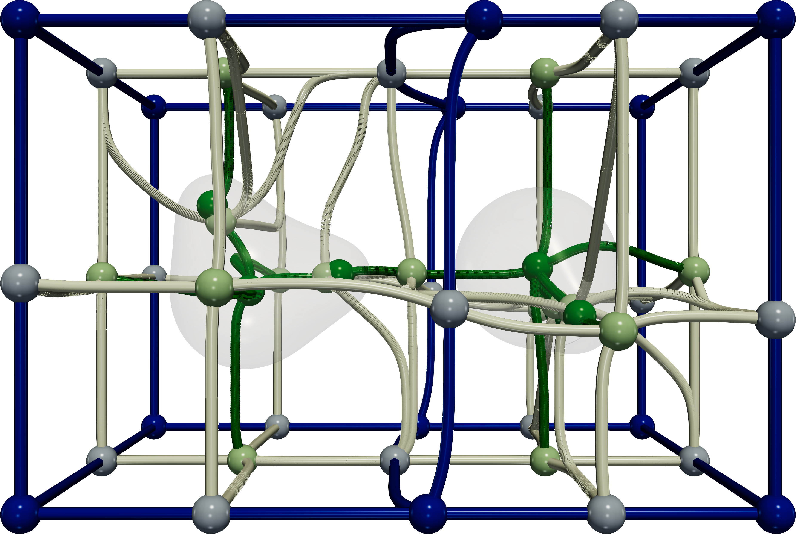

# Description of the molecular structure of water dimer


<div class="grid" markdown>





</div>

<div style="font-size: 75%;"><b><i>
An automatic approach based on Topological Data Analysis extracts the structure and the bonding patterns in water dimer as specific critical points (left plot: maxima and 2-saddles marked as dark-green and light-green points) and specific sub-sets of separatrices (right plot: red and blue curves represent low-persistence and high-persistence 1-separatrices between maxima and 2-saddles) of the Morse-Smale complex of the electron density scalar field of this molecular system. In the right plot, the colors and radii of spheres corresponding to atoms are based on topological information. 
</i></b></div>

---

# Chemical context

The hydrogen bond (HB) in water dimer, (H$_2$O)$_2$, is an archetype of this type of non-covalent interaction (NCI). It represents an HB of a moderate strength, with a significant *electrostatic contribution*. The electron density (ED, $\rho(\vec{r})$) and its derivatives, such as the reduced density gradient (RDG, $s(\vec{r})$) and the sign of the Laplacian of the ED (L2(ED), $sign(\lambda_2)\rho(\vec{r})$) are among the best-suited descriptors for exploring how such interactions manifest in real space, routinely used in quantum chemical topology (QCT, see [this page](definitions.md) for more information). 

In this example, we demonstrate how to apply the tools of TDA to reproduce and augment the typical QTAIM approach, and what one can learn from the topological analysis of these descriptors.

Water dimer in its lowest-energy geometry has four covalent (O-H) bonds and one intermolecular hydrogen bond (O---H). The molecular geometry is depicted in the figure below, where we also  Two oxygen atoms play the role of the HB acceptor and the HB donor (marked in the figure as "a" and "d", respectively), and the hydrogen atoms not explicitly involved in HB are marked with "f" (standing for "free").

GOSIA-TODO - ADD "a", "d", "f" subscripts to figure

{width=50%}

One of the goals of this example is to discern these two types of interactions from the topology of the selected molecular functions. 


# Pipeline description

First, we compute the selected functions - ED, RDG, and L2(ED) - for a single geometry of the water dimer and export them as scalar fields on a 3D grid. These calculations are done analytically in the `DIRAC` software. In the next step, we generate the VTI file containing all three scalar fields. 
This is an input to the `TTK` software, in which we perform the topological analysis. 

This VTI file can be downloaded from [Zenodo](https://zenodo.org/records/17157471); alternatively, we provide the details for the QC calculations and outline the procedure to generate the VTI file in a separate section below.

The final step involves analyzing the selected scalar fields in the `TTK` software. 

## Topological analysis of the electron density

The key point of this analysis is the generation of the Morse-Smale complex of $\rho(\vec{r})$, from which we extract all critical point pairs and one-dimensional separatrices.
As illustrated in the following figure, the algorithm finds many such features (see [this page](topo_models.md) for visualization conventions):

{width=75%}

The first filter we apply selects the subset of critical points and 1-separatrices that do not touch the domain's boundary:

{width=75%}

This allows for identification of features of the electron density that are intrinsic to the molecular domain and have chemical significance.
Precisely, these features include maxima, 2-saddles, and a subset of separatrices that connect 2-saddles to maxima.
Maxima of ED coincide with the positions of atomic nuclei, while 2-saddles and separatrices connecting 2-saddles to maxima indicate the presence of interactions between atoms. This observation agrees with the chemical intuition for the molecular structure of the water dimer and with the QTAIM interpretation of its electron density (see, for example, Fig 3. in [Ghosh et al., J. Mol. Model., 26, 20 (2020)](https://doi.org/10.1007/s00894-019-4274-2)).

This analysis also allows for discerning covalent bonds from the intermolecular hydrogen bond. Precisely, the $2$-saddle indicating the HB in the water dimer is located outside isosurfaces of ED of each water monomer (these surfaces are plotted for an isovalue s=0.1, typically used to indicate the molecular boundary GOSIA-TODO: update this). 
Consequently, the saddle-maximum separatrices attached to $2$-saddles with a low electron density (typically, below $0.1$) can be identified as non-covalent bonds (in red, figure below):

{width=75%}

We emphasize that no persistence-driven topological simplification was applied to the electron density field at the input of the topological analysis pipeline, and all relevant topological features of the electron density were unambiguously identified, given only the input scalar field.
 
Alternatively, this analysis could be performed for the function of the ED, specifically $f(\vec{r}) = - log(\rho(\vec{r}))$, which would prevent the interaction of critical points with the domain's boundary. In that case, the relevant topological features would involve minima, 1-saddles, and separatrices connecting 1-saddles to minima of the studied $f(\vec{r})$. Qualitatively, this would provide the same information of chemical interactions.

As we demonstrate later, this picture of the molecular structure of the system and its chemical interactions is further supported by the analysis of ED derivatives.

The analysis presented thus far also provides quantitative information. Namely, `TTK` allows for extracting the topological persistence of the essential critical point pairs and the electron density values at the critical points. We use this to propose a specific molecular representation - in the figure above, we visualize each atom as a sphere whose radius and color signal the ED value at the corresponding maximum; then, we represent covalent and non-covalent bonding with curves of different colors. 
The topological persistence can then be used to characterize the importance of the atoms and the strength of the bonds (GOSIA-TODO: add link). 


## Analysis of the electron density derivatives

To further refine our analysis, we now explore functions of the derivatives of the electron density, specifically, RDG and L(ED). 
The RDG scalar field is routinely used to analyze NCIs. The most typical approach is to (1) visualize its selected isosurfaces or (2) plot the joint distribution function, either of RDG and ED or RDG and L(ED). The latter representation has been disseminated as the so-called NCI plot (for more details, see, e.g., [Johnson et al., J. Am. Chem. Soc, 132, 6498 (2010)](https://pubs.acs.org/doi/10.1021/ja100936w)).  

GOSIA-maybe show ED only


# Technical details

## Quantum chemistry calculations

### Setup

The molecular structure of water dimer from [Howard et.al., JCTC, 10, 5426 (2014)](https://doi.org/10.1021/ct500860v) is used in all calculations without reoptimization. All molecular descriptors were calculated analytically in the development version of the `DIRAC` software (commit hash `XXXX`) with the Levy-Leblond Hamiltonian, the B3LYP exchange-correlation functional, and the all-electron aug-cc-pVTZ basis set applied to all atoms. All molecular descriptors studied in this tutorial were exported on the rectilinear grid generated for this molecular system, assuming the 0.05 a.u. grid resolution and the 2.0 a.u. margin
(see `DIRAC` manual for the description of visualization options).

### `DIRAC` inputs

* Molecular geometry of water dimer in XYZ format (in Angstrom): [geom.xyz](../data/water_dimer/coordinates/geom.xyz)
* Input for the wave function optimization: [scf.inp](../data/water_dimer/dirac/levy-leblond_b3lyp_aug-cc-pVTZ_spacing_0.05_margin_2.0/scf.inp)
* Input for calculations of scalar fields: [vis.inp](../data/water_dimer/dirac/levy-leblond_b3lyp_aug-cc-pVTZ_spacing_0.05_margin_2.0/vis.inp)

### Calculations

Assuming the `pam` script of `DIRAC` is present in `$PATH`, the calculations are performed in two steps.

* Step 1. Wave function optimization:

```
mol=geom.xyz
inp_scf=scf.inp
pam --inp=$inp_scf --mol=$mol --outcmo
```

* Step 2. Calculations and export of real-space densities:

```
mol=geom.xyz
inp_vis=vis.inp
pam --inp=$inp_vis --mol=$mol --incmo --get="*.h5"
```

See `DIRAC` manual for "Resources and additional information"


## Generation of VTI files

We provide a script for reformatting HDF5 files exported from `DIRAC` into one VTI file used by `TTK`: [prep_vti.sh](../python/utils/prep_vti.sh).
It needs an input file, which contains the names of HDF5 files that should be used; this is provided as [prep_vti.inp](../data/water_dimer/vti/prep_vti.inp)

Copy these two files to the directory containing HDF5 files exported from `DIRAC` and execute:

```
./prep_vti.sh 
```

Simultaneously, this applies the resampling filter ("ResampleToImage") without changing the number of grid points or the domain's bounds.
We do this to change the type of input data from a 'point cloud data' to a 'uniform rectilinear grid data', which is optimal for TTK.

This VTI file can also be downloaded from [Zenodo](https://zenodo.org/records/17157471).


## Topological Data Analysis

GOSIA/JULIEN-TODO: prepare pvsm and python scripts

To reproduce the images and to explore the TDA pipeline, use the [PVSM](pvsm/water_dimer_bonds/ed_rdg_led.pvsm) state file or the [PYTHON](python/water_dimer_bonds/ed_rdg_led.py) script:

* create (see sections above) or download the `VTI` file to the `data/water_dimer/vti` directory (as [start_data_ed_rdg_led.vti](`data/water_dimer/vti/start_data_ed_rdg_led.vti`))

* go to the root directory of this repository ([here](../)) and enter the following command:

```
paraview --state=pvsm/water_dimer_bonds/ed_rdg_led.pvsm
```

or run the python script (TODO?):

```
pvpython python/water_dimer_bonds/ed_rdg_led.py
```

These scripts also import input atomic coordinates (in a.u.), which are in the [`geom.csv`](`data/water_dimer/coordinates/geom.csv`) file.


## Resources and additional information

* [Prerequisites](https://tda-qchem.github.io/tda-qchem-examples/)
* [DIRAC](http://www.diracprogram.org/)
* useful `DIRAC` tutorials:
    * [links](XXXX).
* [TTK](https://topology-tool-kit.github.io/)
* useful `TTK` tutorials:
    * [Molecule1](https://topology-tool-kit.github.io/examples/interactionSites/)
    * [Molecule2](https://topology-tool-kit.github.io/examples/morseMolecule/)
    * [Bivariate analysis](https://topology-tool-kit.github.io/examples/builtInExample2/)
* [qcten](TODO)


